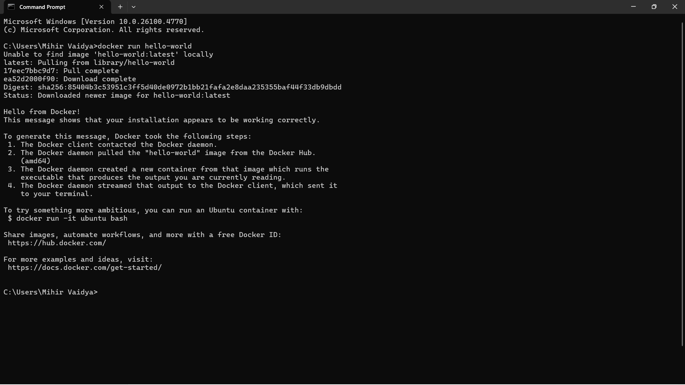
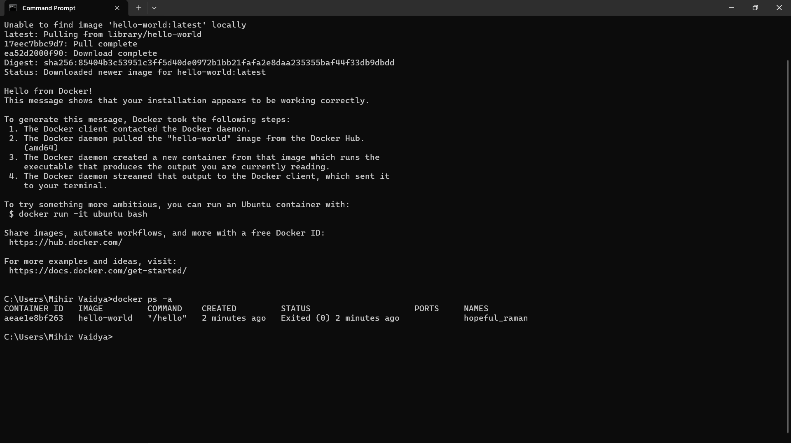
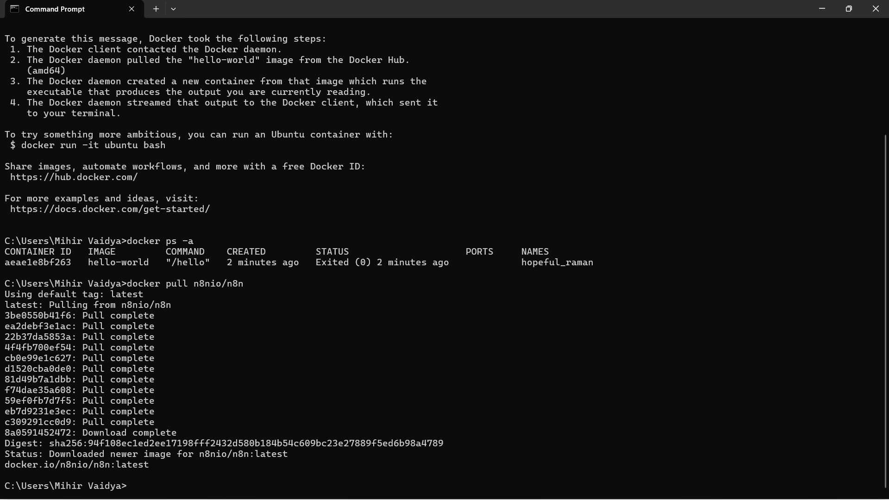
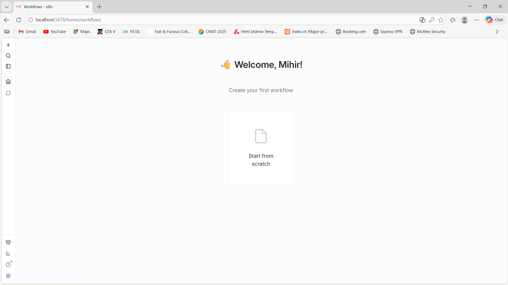

<h1 align="center">🌐 Cloud Computing with DevOps Practical</h1>

<h2>📋 Students Information</h2>

<table border="1" cellpadding="10">
<tr>
<th>Name</th>
<th>Enrollment Number</th>
<th>Practical Set</th>
</tr>

<tr>
<td>Mihir Vaidya</td>
<td>202504104610024</td>
<td>5.1A</td>
</tr>
</table>

<h2>🏫 Logos</h2>

<h2>📚 Subject</h2>

Cloud Computing with DevOps

<h2>📌 Practical Overview</h2>

This repository contains Java programs demonstrating pattern printing and number logic.
It includes proper documentation, screenshots, and execution steps.

<h2>📝 Notes</h2>
<ul>
<li>Ensure Java is installed</li>
<li>Run commands in terminal</li>
<li>Keep project folder clean</li>
</ul>

<h2>📸 Screenshots</h2>

<h4>Hello Docker</h4>

<h4>Docker PS</h4>

<h4>n8n Runnning</h4>

<h4>n8n Interface</h4>
